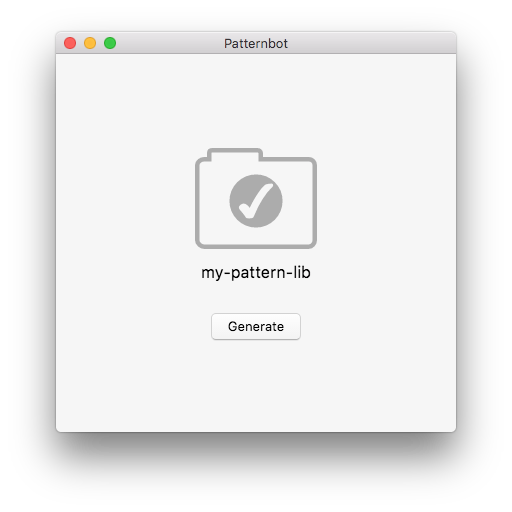

#  Patternbot

*Your pompous and persnickety patterning robot.*



There are lots of fantastic tools for creating style guides and pattern libraries—but they all have a lot of embedded knowledge (command line, Gulp, Grunt, PHP, Handlebars, SASS, etc.)

It’s just too much *stuff* for my students. I don’t want them to have to learn the tool, I want them to use a tool and get on with designing.

My aim is not to replace the wonderful tools that exist, but simplify them into a very minimal GUI package that can get the students familiarized with using style guides without having to learn all the extra stuff.

---

## Download

Download the latest version of Patternbot below:

### [⬇ Download for MacOS](https://github.com/thomasjbradley/patternbot/releases/download/v1.1.2/Patternbot-1.1.2.dmg)
### [⬇ Download for Windows](https://github.com/thomasjbradley/patternbot/releases/download/v1.1.2/Patternbot-Setup-1.1.2.exe)

---

## Ideas for folder structure

Inspired by lots of other tools that exist.

```
common/
  modules.css
  grid.css             Determine all sizes and create sample layouts.
  type.css             Create a preview using the standard classes.
  theme.css            Use CSS variables inside `:root {}` to define colours & fonts.
patterns/
  buttons/
    index.html
    main.css
    README.md          Could contain element info? Why? Rational?
  lists/
    unordered.html     Each file would be used to generate the examples.
    ordered.html
    main.css
    main.js            JS should also be supported.
  header/
    index.html
    main.css
images/
  icons.svg            Parse all the <symbol> tags and generate icon previews.
  logo.svg
  logo-64.svg          Find all the images that start with `logo` and display them.
  logo-32.svg
  logo-16.svg
  banner.jpg
pages/
  home.html
  about.html
pattern-library.html   The final output. A single HTML file with necessary CSS & JS embedded.
```

---

## Questions

- Without a preprocessor how do we include all the CSS on the example pages?
  - Link every file at the top?
  - Have Patternbot generate a concatenated file?
- Should Patternbot include a web server? Browsersync?

---

## What will show for the parsable files

Here’s a list of things that will show in the interface for the parsable files.

### Brand

- [x] Grab font-families from `theme.css`, show different weights & styles
- [x] Use the large full alphabet display
- [x] Show a grid of available colours with Hex & RGB
- [x] Show the name assigned to it from the `theme.css` file
- [x] Show the variable used to access it

### Gridifier

*This is completely automated.*

- [x] Available sizes, showing size boxes
- [x] Show media queries & sizes for each media query
- [x] Some sample text
- [x] Link to Gridifier cheat sheet

### Typografier

*All these things should be styled within the `theme.css` file.*

- [x] Show font sizes & media queries
- [x] Show a waterfall of `<h#>` tags
- [x] Example paragraphs & columns?
- [x] Show all the different font sizes
- [x] Show all three list types
- [x] Show inline elements: `del`, `ins`, `abbr`, `sup`, `sub`, `dfn`, `b`, `strong`, `i`, `em`, `cite`
- [x] Show gutters, push, pad, islands
- [x] Show blockquote
- [x] Show links
- [x] Link to Typografier cheat sheet

### Modulifier

*These things should only be shown if they are enabled.*

- [x] List groups
- [x] Embed containers
- [x] Media objects
- [x] Skip links
- [x] Link to Modulifier cheat sheet

### Icons

- [x] Parse the SVG sprite sheet and find all the `<symbol>` tags
- [x] Show each symbol at a couple different sizes & colours?

---

## Resources

After looking through tonnes of resources these are the things that stick out to me as inspiration.

### Articles

- **https://stuffandnonsense.co.uk/blog/about/designing-inspired-style-guides-presentation-slides-and-transcript**
- **https://24ways.org/2016/designing-imaginative-style-guides/**
- http://styleguides.io/articles.html
- https://www.smashingmagazine.com/2015/04/an-in-depth-overview-of-living-style-guide-tools/
- https://www.smashingmagazine.com/2015/03/automating-style-guide-driven-development/
- http://atomicdesign.bradfrost.com/resources/
- http://danielmall.com/articles/content-display-patterns/
- https://css-tricks.com/design-systems-building-future/
- http://alistapart.com/article/from-pages-to-patterns-an-exercise-for-everyone
- https://www.smashingmagazine.com/2016/12/how-creating-a-design-language-can-streamline-your-ux-design-process/

### Tools

- **https://fbrctr.github.io/**
- **http://livingstyleguide.devbridge.com/**
- https://github.com/PebbleRoad/tapestry
- https://github.com/cloudfour/drizzle
- http://demo.patternlab.io/?p=all
- https://hugeinc.github.io/styleguide/index.html
- https://github.com/bjankord/Style-Guide-Boilerplate
- http://barebones.paulrobertlloyd.com/
- https://trulia.github.io/hologram/
- https://bjankord.github.io/Style-Guide-Boilerplate/
- http://brettjankord.com/projects/style-guide-boilerplate/
- https://github.com/fbrctr/fabricator-assemble
- https://browsersync.io/

### Examples

- **http://ux.mailchimp.com/patterns**
- **https://standards.usa.gov/**
- **https://www.mapbox.com/base/**
- **https://walmartlabs.github.io/web-style-guide/**
- http://rizzo.lonelyplanet.com/styleguide/design-elements/colours
- http://primercss.io/scaffolding/
- http://www.bbc.co.uk/gel
- http://clearleft.com/styleguide
- http://patternprimer.adactio.com/
- https://editorially.github.io/styleguide/
- https://www.ibm.com/design/language/
- https://www.yelp.com/styleguide
- http://solid.buzzfeed.com/
- http://primercss.io/layout/
- http://patterns.alistapart.com/
- http://oli.jp/2011/style-guide/
- https://projects.invisionapp.com/boards/MX1IZXSBQ3AY7
